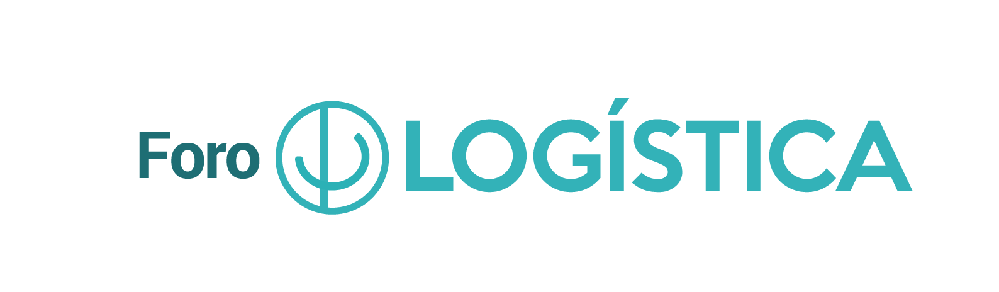

# Documentación Curso IA en Almacenes 2026

Documentos adjuntos para el curso de IA en almacenes 2026

[Agenda](Agenda_Curso_IA_Almacenes.pdf)

## DIA 1:
- ML:  
 [Ejercicio ML en Excel](datos_ejercicio_ML.xlsx) 
 [Datos para Google Vertex](datos_prevision_vertex.csv)  
 
- Ejemplo mejora productividad  
 [Informe de incidencias de almacén](incidencias_almacen.docx)  
 [Prompt a usar](prompt_incidencias_almacen.txt)
 
- IA en almacenaje y gestión de ubicaciones  
 [Ejemplo slotting dinamico](slotting_dinamico_IA.html)  
 [Almacenaje por afinidad](afinidad_productos_IA.html)  
 
- IA en picking  
 [Ejemplo de rutas picking con LLM](rutas_picking_LLM.html)  
 
- KPI e indicadores  
 [Ejemplo de KPI con IA](kpi_analisis_IA.html)  
 
- Ejercicio grupal aplicado  
 [Plantilla ejercicio](plantillaEjercicio1.pptx)  
 
 [excel referencias](EULEN_Catalogo_Referencias_200.xlsx)
 
## DIA 2:
 - Prompts  
 [Ejercicio1](ejercicio1_alumnos.html)  
 - Ejercicio NotebookLM  
 [Normativa seguridad](normativa_seguridad.pdf)  
 [Procedimiento almacén](procedimiento_almacen.pdf)
 - Diseño de un chatbot de almacén básico  
 [Ejercicio](ejercicio_chatbot_almacen.html)
 - Demo MCP Server  
 [Prompt consulta simple](promp_mcp_1.txt)  
 [Prompt prediccion demanda](prompt_mcp_prediccion.txt)  
 [Prompt control de picking](prompt_mcp_picking.txt)
 - Ejercicio final
 [Slides ejercicio final](ejercicio_integrador_dia2.pptx)
 
 
 

